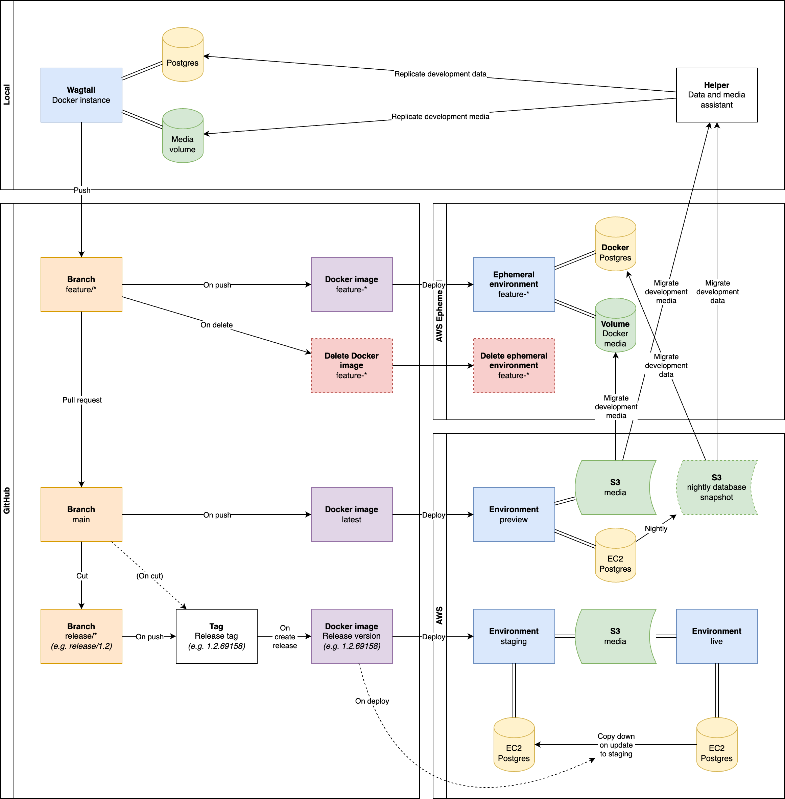
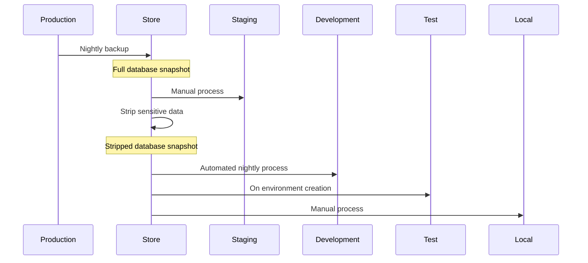

# Proposed Ways of Working for ETNA

## Environments

- Production/live
- Staging/pre-production
- Preview
- Feature
- Local

| Environment | Application              | Version                       | Database                            | Server                               |
| ----------- | ------------------------ | ----------------------------- | ----------------------------------- | ------------------------------------ |
| Production  | Docker image from GitHub | Latest deployed release       | Live Postgres database              | Production EC2 instance behind nginx |
| Staging     | Docker image from GitHub | Next release                  | Copy of live database               | Staging EC2 instance behind nginx    |
| Preview     | Docker image from GitHub | In line with `main` branch    | Copy of live database               | Preview EC2 instance behind nginx    |
| Feature     | Docker image from GitHub | In line with feature branches | Copy of live database inside Docker | Feature EC2 instance                 |
| Local       | Local Docker image       | -                             | Copy of live database inside Docker | Docker Desktop                       |

## Promotion process

### Local

- Anything goes

### Local → Feature

1. Create new branch for feature (`feature/*`)
1. Feature environment automatically created through GitHub Actions
1. Docker image created and added to feature environment
1. Test latest features in an AWS environment
1. Push changes to rebuild image and update hosted application

### Feature

- Feature applciation is accessible to all
- Postgres database created as a Docker image
- Feature branch can be deleted at any point and environment will also be deleted

### Feature → Preview

1. Open PR from feature branch (`feature/*`) to working branch `main`
1. Reviewer can use deployed preview environment to check changes
1. Reviewer approves changes
1. Merge after review
1. Docker image (`latest`) updated and deployed to development environment

### Preview

- Preview applciation is accessible to all
- Follows working branch (`main`)
- Working branch is protected
- More CI needed for E2E and acceptance tests
- **Working branch should always be deployable**

### Preview → Staging

1. Create a release by manually running a workflow called "Create a release" (``.github/workflows/create-release-tag.yml`)
1. A calver tag is created and published in the format `YY.0M.0D.[build number]` (see https://calver.org/ for more info)
1. A draft release is automatically created in GitHub (`.github/workflows/draft-release.yml`)
1. The release can be checked and some release notes can be added
1. Publishing the release publishing then causes the deployment to run in `.github/workflows/release.yml` which:
    1. Builds the Docker image
    1. Uploads the image to GitHub
    1. The pipeline _will_ deploy it to staging/pre-prod (once AWS is up and running)
1. Others can carry on pushing to working branch
<!-- 1. Each push to release branch will create a new tag using sequential number (e.g. `v23.08.09.32749`) -->
<!-- 1. Create a release using the tag you want to deploy -->
<!-- 1. Versioned Docker image is automatically created using the release tag -->

### Staging

- For stakeholders to test and signoff latest features before go live
- Database is copied from production
- Try anything

### Staging → Production

1. [TODO]

<!-- ### Hotfix process

When we need to make a fix to production code but there is already changes in the trunk that we don't want to release.

1. Create a branch from the release you want to hotfix (e.g. from `release/7.4`)
1. Apply the fix
1. Open a PR back into the release branch
1. Reviewer approves changes
1. Merge after review
1. Versioned Docker image is automatically created using sequential number (e.g. `7.4.34921`)
1. Create a release using the new tag (Docker will build)
1. [TODO] - same process as staging → production
1. Open a PR to duplicate the changes back into the working branch

[Hotfix process diagram](https://www.mermaidchart.com/app/projects/1236b2e9-bed7-46dd-beb3-98a52fc4c209/diagrams/6bac87a1-ca63-438d-81dc-9128aa2f0baa/version/v0.1/view) -->

## Database

